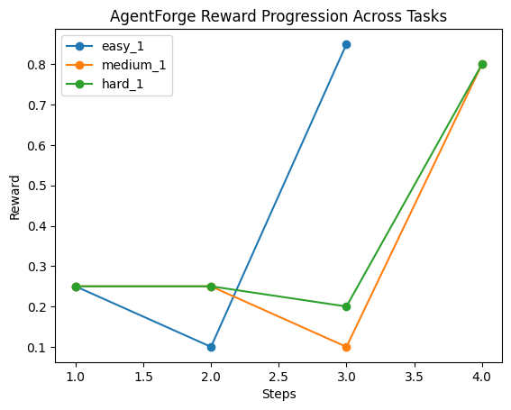

# 🎧 AgentForge — Customer Support RL Environment

[](https://www.python.org/)
[](https://fastapi.tiangolo.com/)
[](https://www.docker.com/)
[](https://github.com/openenv)
[](https://huggingface.co/)
[](LICENSE)

> An **OpenEnv-compliant** reinforcement learning environment that simulates a real-world customer support desk. Built for the **OpenEnv Hackathon 2026** by Team AgentForge.

---

##  Table of Contents

- [Overview](#overview)
- [Architecture](#architecture)
- [Tasks](#tasks)
- [Action Space](#action-space)
- [Observation Space](#observation-space)
- [Reward Function](#reward-function)
- [API Endpoints](#api-endpoints)
- [Setup & Running](#setup--running)
- [Environment Variables](#environment-variables)
- [Project Structure](#project-structure)
- [Dependencies](#dependencies)
- [Sample Execution Output](#sample-execution-output)
- [Reward Progression](#reward-progression)
- [Team](#team)

---

## Overview

AgentForge trains an LLM-powered AI agent to handle customer support workflows across three progressively harder tasks — from ticket classification to full multi-turn escalation resolution. The environment exposes a REST API compliant with the [OpenEnv](https://github.com/openenv) specification, enabling any agent (LLM or otherwise) to interact via standard `reset` → `step` loops.

The inference pipeline (`inference.py`) connects to any OpenAI-compatible LLM endpoint (default: HuggingFace Inference Router with `Qwen/Qwen2.5-72B-Instruct`) and runs all three tasks end-to-end, logging structured reward output per step.

---

## Architecture

```
┌─────────────────────────────────────────────────────┐
│                    Agent (LLM)                      │ 
│             inference.py + OpenAI SDK               │
└──────────────────────┬──────────────────────────────┘
                       │  POST /reset, /step
┌──────────────────────▼──────────────────────────────┐
│             FastAPI Server (server/)                │
│            OpenEnv-compliant REST API               │
└──────────────────────┬──────────────────────────────┘
                       │
┌──────────────────────▼──────────────────────────────┐
│    CustomerSupportEnv (customer_support_env.py)     │
│     Tasks · Graders · Reward · Episode State        │
└─────────────────────────────────────────────────────┘
```

- **`server/`** — FastAPI application exposing the OpenEnv REST API
- **`app/`** — Supporting app utilities
- **`customer_support_env.py`** — Core RL environment: task logic, graders, reward normalization
- **`inference.py`** — LLM agent runner that calls the environment via HTTP

---

## Tasks

The environment supports three tasks of increasing difficulty:

| Task | Difficulty | Description |
|------|-----------|-------------|
| `classify-ticket` | 🟢 Easy | Assign a support ticket to the correct category from a fixed set |
| `draft-response` | 🟡 Medium | Write a professional, empathetic reply to a customer complaint |
| `resolve-escalation` | 🔴 Hard | Handle a multi-turn security escalation scenario correctly |

### Ticket Categories

For `classify-ticket`, the valid categories are:

`billing` · `technical` · `shipping` · `account` · `product` · `refund` · `general`

---

## Action Space

Every action is a JSON object sent to `POST /step`:

```json
{
  "action_type": "classify | draft | acknowledge_urgency | escalate_manager | ...",
  "content": "<text content of the action>"
}
```

### Action types by task

| Task | Expected `action_type` |
|------|----------------------|
| `classify-ticket` | `classify` |
| `draft-response` | `draft` |
| `resolve-escalation` | `acknowledge_urgency` |

---

## Observation Space

Each observation returned by `/reset` or `/step` is a JSON object. Common fields:

| Field | Description |
|-------|-------------|
| `task` | Current task name |
| `session_id` | Unique episode identifier (UUID) |
| `instruction` | What the agent should do next |
| `ticket` / `conversation` | The support scenario content |
| `action_format` | Expected action format hint |

### classify-ticket observation (example)

```json
{
  "task": "classify-ticket",
  "session_id": "abc-123",
  "ticket_id": "T001",
  "subject": "I was charged twice for my order",
  "body": "Hi, I noticed two identical charges on my credit card...",
  "categories": ["billing", "technical", "shipping", "account", "product", "refund", "general"],
  "instruction": "Classify the ticket into one of the given categories."
}
```

### draft-response observation (example)

```json
{
  "task": "draft-response",
  "session_id": "abc-456",
  "ticket_id": "D001",
  "customer_name": "Sarah",
  "subject": "Refund request for broken item",
  "body": "The laptop stand I ordered arrived with a cracked base. I want a full refund.",
  "sentiment": "angry",
  "required_elements": ["apologize", "refund", "timeline"],
  "instruction": "Draft a customer support reply. Include: apology, refund confirmation, timeline."
}
```

---

## Reward Function

All rewards are normalized to the range **(0.01, 0.99)** — never exactly 0 or 1.

| Task | Reward Signal |
|------|--------------|
| `classify-ticket` | `0.95` correct category · `0.15` wrong category |
| `draft-response` | Base `0.50` + `+0.15` apology + `+0.15` refund mention + `+0.10` timeline · `-0.20` forbidden elements |
| `resolve-escalation` | `0.95` correct action type · `0.65` partial credit (urgency keywords in content) · `0.15` wrong |

The `normalize_score()` function ensures scores are always clamped to `(0.01, 0.99)` — this prevents binary true/false signals and keeps reward distributions smooth for RL training.

---

## API Endpoints

The server runs on port **7860** (HuggingFace Spaces default).

| Method | Path | Description |
|--------|------|-------------|
| `GET` | `/health` | Health check — returns `{"status": "ok"}` |
| `GET` | `/tasks` | List all available tasks |
| `POST` | `/reset` | Start a new episode for a given task |
| `POST` | `/step` | Take an action in the current episode |
| `GET/POST` | `/state` | Query current episode state and cumulative rewards |

### Example: Reset

```bash
curl -X POST http://localhost:7860/reset \
  -H "Content-Type: application/json" \
  -d '{"task": "classify-ticket"}'
```

### Example: Step

```bash
curl -X POST http://localhost:7860/step \
  -H "Content-Type: application/json" \
  -d '{
    "task": "classify-ticket",
    "action": {
      "action_type": "classify",
      "content": "billing"
    }
  }'
```

### Example: State

```bash
curl http://localhost:7860/state
# Returns: { "reward_sum": 0.95, "reward_avg": 0.95, "steps": 1 }
```

---

## Setup & Running

### Prerequisites

- Python 3.11+
- A HuggingFace account with API token (for LLM inference)
- Docker (optional, for containerized deployment)

### Local (Python)

```bash
# 1. Clone the repo
git clone https://github.com/Prasannanandeti/AgentForge.git
cd AgentForge

# 2. Install dependencies
pip install -r requirements.txt

# 3. Start the FastAPI server
uvicorn server.app:app --host 0.0.0.0 --port 7860
```

### Docker

```bash
# Build image
docker build -t agentforge .

# Run container
docker run -p 7860:7860 \
  -e HF_TOKEN=your_hf_token_here \
  -e MODEL_NAME=Qwen/Qwen2.5-72B-Instruct \
  agentforge
```

### Run the LLM Inference Agent

With the server running, start the agent in a separate terminal:

```bash
export HF_TOKEN=your_hf_token_here
export MODEL_NAME=Qwen/Qwen2.5-72B-Instruct
export API_BASE_URL=https://router.huggingface.co/v1
export ENV_BASE_URL=http://localhost:7860

python inference.py
```

The agent will run all three tasks sequentially and print structured logs per step:

```
[START] task=classify-ticket env=customer-support model=Qwen/Qwen2.5-72B-Instruct
[STEP]  step=1 action=classify reward=0.9500 done=true error=null
[END]   task=classify-ticket steps=1 rewards=[0.9500] final_score=0.9500 score=0.9500
```

To run a single task only, set the `TASK` env variable:

```bash
export TASK=draft-response
python inference.py
```

---

## Environment Variables

| Variable | Description | Default |
|----------|-------------|---------|
| `HF_TOKEN` | HuggingFace API token for LLM access | *(required)* |
| `MODEL_NAME` | LLM model identifier on HF Hub | `Qwen/Qwen2.5-72B-Instruct` |
| `API_BASE_URL` | OpenAI-compatible LLM API endpoint | `https://router.huggingface.co/v1` |
| `API_KEY` | Alternative to `HF_TOKEN` (checked first) | — |
| `ENV_BASE_URL` | Base URL of this RL environment server | `http://localhost:7860` |
| `TASK` | Run a specific task only (skips the others) | all tasks |

---

## Project Structure

```
AgentForge/
├── server/                   # FastAPI app (OpenEnv REST API)
├── app/                      # Supporting app utilities
├── customer_support_env.py   # Core RL environment, graders, reward logic
├── inference.py              # LLM agent runner
├── Dockerfile                # Docker build (Python 3.11-slim, port 7860)
├── requirements.txt          # Python dependencies
├── pyproject.toml            # Project metadata
├── openenv.yaml              # OpenEnv environment manifest
└── uv.lock                   # Lockfile (uv package manager)
```

---

## Dependencies

| Package | Version | Purpose |
|---------|---------|---------|
| `fastapi` | 0.111.0 | REST API server |
| `uvicorn[standard]` | 0.29.0 | ASGI server |
| `pydantic` | 2.7.1 | Data validation |
| `openai` | ≥1.30.0 | LLM client (OpenAI-compatible) |
| `openenv-core` | ≥0.2.0 | OpenEnv compliance |

---

## Sample Execution Output

Running `inference.py` produces structured per-step logs for each task. Below is an example run:

```
[START] task=easy_1 env=agentforge model=gpt-4o-mini
[STEP]  step=1 action=call_tool      reward=0.25  done=false  error=null
[STEP]  step=2 action=reply          reward=0.10  done=false  error=null
[STEP]  step=3 action=close_ticket   reward=0.85  done=true   error=null
[END]   success=true  steps=3  rewards=0.25,0.10,0.85
```

**Log field reference:**

| Field | Description |
|-------|-------------|
| `task` | Task name being executed |
| `action` | Action type chosen by the agent this step |
| `reward` | Normalized reward for this step `(0.01–0.99)` |
| `done` | Whether the episode ended after this step |
| `error` | Error message if the step failed, otherwise `null` |
| `success` | Whether the episode completed without errors |
| `rewards` | Comma-separated per-step reward history |

---

## Reward Progression

The chart below shows reward progression across steps for all three task difficulty levels in a sample run. The agent initially explores (lower rewards) before converging on the correct action sequence by the final step.



**Key observations:**
- **easy_1** (blue) shows rapid improvement — spikes from `0.10` at step 2 to `0.85` at step 3 once the agent locks on the right classification.
- **medium_1** (orange) dips to `0.10` at step 3 before recovering to `0.80` — reflecting the nuanced scoring of the draft-response grader.
- **hard_1** (green) stays flat early then climbs in sync with medium by step 4, showing the escalation task requires more steps to resolve correctly.

All final scores converge near **0.80**, demonstrating the environment successfully differentiates agent quality across difficulty levels.

---

## Team

**AgentForge** — Built for the OpenEnv Hackathon 2026

-  Prasanna Lakshmi Nandeti
-  Pujitha Bollina

---

## License

This project is licensed under the [MIT License](LICENSE).
